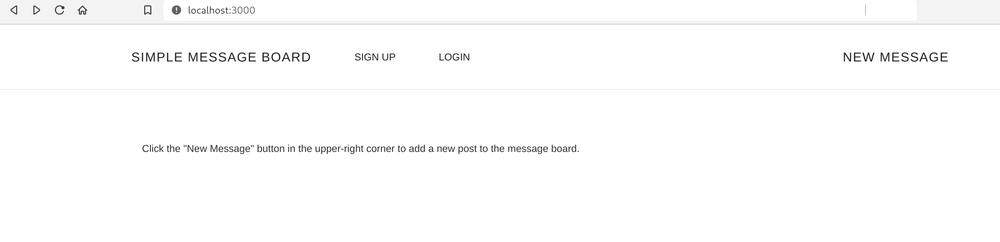

# Simple Ruby Message Board

A plain and no-frills online message board, written using ruby-on-rails:



Has the following features:

* User Sign Up
* Login and Logout
* Create / Edit / Delete Messages from the Message Board
* Create / Edit / Delete Comments from the individual Messages
* Basic Form Validation
* Rspec Unit Tests
* Capybara Feature Testing

Utilizes:

* `devise` to handle the user logins
* `simple_form` for the forms
* `rspec` for unit tests
* `capybara` for feature tests

# Setup

Run docker-compose to build and start a container instance of this app:

```bash
docker-compose up -d
```

Afterwards, navigate to the following:

```
http://localhost:3000
```

Then sign-in to create a new account and afterwards, login with that account to start posting messages.

# Authors

Written by Robert Bisewski at Ibis Cybernetics. For more information, contact:

```
https://www.ibiscybernetics.com
```

Or send an email to:

```
contact@ibiscybernetics.com
```
